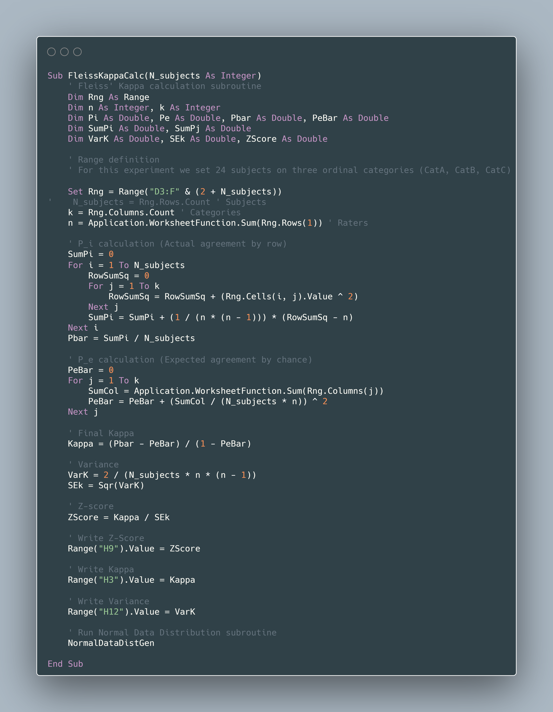

# Fleiss' Kappa Calculation

## Description
Fleiss' Kappa evaluates the agreement between multiple raters when classifying items into nominal categories.

## Input Variables
- `N`: Total number of subjects/items evaluated
- `n`: Number of raters per subject
- `k`: Number of possible categories
- `data_matrix`: N × k matrix with assignment frequencies per category for each subject

## VBA Animation


## Pseudocode

```
BEGIN

    // Step 1: Initialize variables
    DECLARE N, n, k AS integers
    DECLARE data_matrix[N][k] AS integer matrix
    DECLARE P_i[N] AS array of real numbers
    DECLARE P_j[k] AS array of real numbers
    DECLARE P_bar, P_e_bar AS real numbers
    
    // Step 2: Read input data
    READ N, n, k
    FOR i = 1 TO N DO
        FOR j = 1 TO k DO
            READ data_matrix[i][j]
        END FOR
    END FOR
    
    // Step 3: Calculate P_i (proportion of agreement for each subject)
    FOR i = 1 TO N DO
        sum = 0
        FOR j = 1 TO k DO
            sum = sum + (data_matrix[i][j])^2
        END FOR
        P_i[i] = (1 / (n * (n - 1))) * (sum - n)
    END FOR
    
    // Step 4: Calculate P_bar (mean proportion of observed agreement)
    P_bar = 0
    FOR i = 1 TO N DO
        P_bar = P_bar + P_i[i]
    END FOR
    P_bar = P_bar / N
    
    // Step 5: Calculate P_j (proportion of assignments to each category)
    FOR j = 1 TO k DO
        sum = 0
        FOR i = 1 TO N DO
            sum = sum + data_matrix[i][j]
        END FOR
        P_j[j] = sum / (N * n)
    END FOR
    
    // Step 6: Calculate P_e_bar (proportion of agreement expected by chance)
    P_e_bar = 0
    FOR j = 1 TO k DO
        P_e_bar = P_e_bar + (P_j[j])^2
    END FOR
    
    // Step 7: Calculate Fleiss' Kappa
    IF P_e_bar ≠ 1 THEN
        kappa = (P_bar - P_e_bar) / (1 - P_e_bar)
    ELSE
        PRINT "Error: P_e_bar = 1, division by zero"
        TERMINATE
    END IF
    
    // Step 8: Display results
    PRINT "Mean proportion of observed agreement (P̄):", P_bar
    PRINT "Proportion of expected agreement (P̄ₑ):", P_e_bar
    PRINT "Fleiss' Kappa:", kappa
    
    // Step 9: Interpret result
    IF kappa < 0 THEN
        PRINT "Interpretation: Poor agreement (worse than chance)"
    ELSE IF kappa ≤ 0.20 THEN
        PRINT "Interpretation: Slight agreement"
    ELSE IF kappa ≤ 0.40 THEN
        PRINT "Interpretation: Fair agreement"
    ELSE IF kappa ≤ 0.60 THEN
        PRINT "Interpretation: Moderate agreement"
    ELSE IF kappa ≤ 0.80 THEN
        PRINT "Interpretation: Substantial agreement"
    ELSE
        PRINT "Interpretation: Almost perfect agreement"
    END IF

END
```

## Fleiss' Kappa Code



## Input Example

For 10 subjects evaluated by 3 raters across 5 categories:

```
N = 10
n = 3
k = 5

data_matrix:
[2, 0, 0, 1, 0]  // Subject 1
[0, 3, 0, 0, 0]  // Subject 2
[1, 1, 1, 0, 0]  // Subject 3
...
```

## Kappa Value Interpretation

| Kappa Value | Interpretation |
|-------------|----------------|
| < 0.00 | Poor agreement |
| 0.00 - 0.20 | Slight agreement |
| 0.21 - 0.40 | Fair agreement |
| 0.41 - 0.60 | Moderate agreement |
| 0.61 - 0.80 | Substantial agreement |
| 0.81 - 1.00 | Almost perfect agreement |

## Notes
- Fleiss' Kappa ranges between -1 and 1
- A value of 1 indicates perfect agreement
- A value of 0 indicates agreement equal to that expected by chance
- Negative values indicate agreement worse than chance


